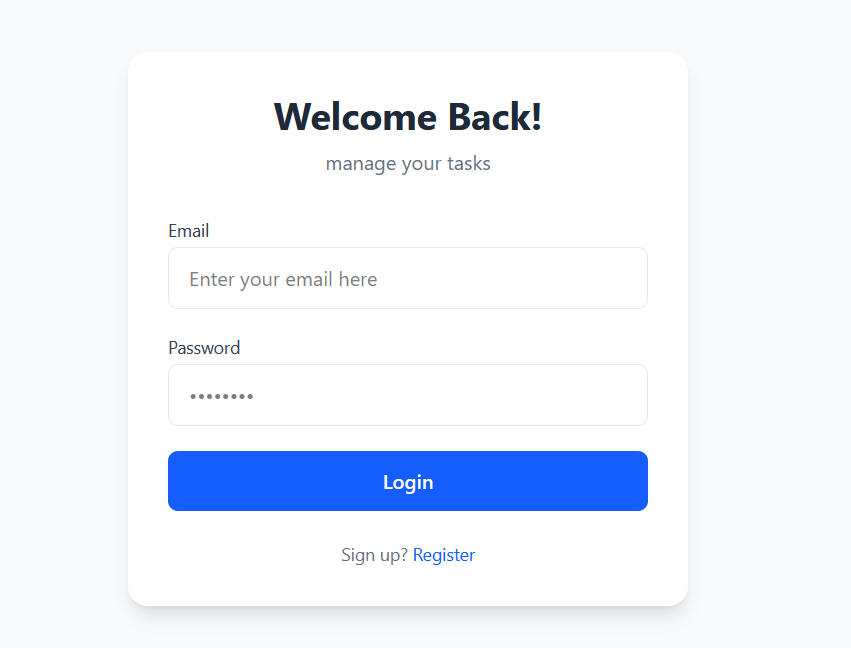
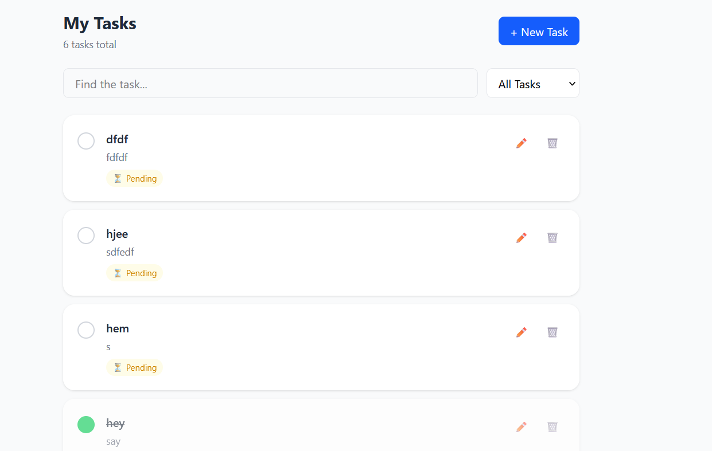

# Task Manager App 📋

A full-stack Task Management Web Application built with the MERN stack.

## 🚀 Features

- User Registration & Login
- JWT Authentication
- Create, Read, Update, Delete Tasks
- Mark Tasks as Completed/Pending
- Search & Filter Tasks
- Pagination
- Responsive UI

## 🛠️ Tech Stack

### Backend
- Node.js v24+ (built-in `--watch`, `--env-file`)
- Express.js
- MongoDB Atlas + Mongoose
- JWT Authentication (`jose`)
- Argon2id Password Hashing (`argon2` package)

### Frontend
- React.js (Vite)
- React Router v7
- Tailwind CSS
- Axios

## 📁 Project Structure

```
TaskManager/
├── backend/
│   ├── config/
│   │   └── db.js
│   ├── controllers/
│   │   ├── authController.js
│   │   └── taskController.js
│   ├── middleware/
│   │   └── authMiddleware.js
│   ├── models/
│   │   ├── User.js
│   │   └── Task.js
│   ├── routes/
│   │   ├── authRoutes.js
│   │   └── taskRoutes.js
│   ├── .env
│   └── server.js
└── frontend/
    ├── src/
    │   ├── api/
    │   │   └── axios.js
    │   ├── context/
    │   │   └── AuthContext.jsx
    │   └── pages/
    │       ├── Login.jsx
    │       ├── Register.jsx
    │       └── Dashboard.jsx
    └── index.html
```

## ⚙️ Setup Instructions

### Prerequisites
- Node.js v24+
- MongoDB Atlas account

### Backend Setup

1. Clone the repository:
```bash
git clone https://github.com/surajsrggupta/taskManager.git
cd task-manager/backend
```

2. Install dependencies:
```bash
npm install
```

3. Create `.env` file:
```bash
PORT=5000
MONGO_URI=your_mongodb_connection_string
JWT_SECRET=your_secret_key
```

4. Start server:
```bash
npm run dev
```

### Frontend Setup

1. Go to frontend folder:
```bash
cd ../frontend
```

2. Install dependencies:
```bash
npm install
```

3. Start development server:
```bash
npm run dev
```

4. Open in browser:
```
http://localhost:5173
```

## 🔗 API Endpoints

### Auth Routes
| Method | Endpoint | Description |
|--------|----------|-------------|
| POST | `/api/auth/register` | User registration |
| POST | `/api/auth/login` | User login |

### Task Routes (Protected)
| Method | Endpoint | Description |
|--------|----------|-------------|
| GET | `/api/tasks` | Get all tasks |
| POST | `/api/tasks` | Create task |
| PUT | `/api/tasks/:id` | Update task |
| DELETE | `/api/tasks/:id` | Delete task |
| PATCH | `/api/tasks/:id/toggle` | Toggle status |

## 🔐 Security Features

- Argon2id password hashing (`argon2` package)
- JWT tokens via `jose` library
- Protected routes with middleware
- User ownership validation on all tasks

## 📸 Screenshots




## 👨‍💻 Author
**Mr. Suraj Gupta**
- Email: Surajsrggupta@gmail.com